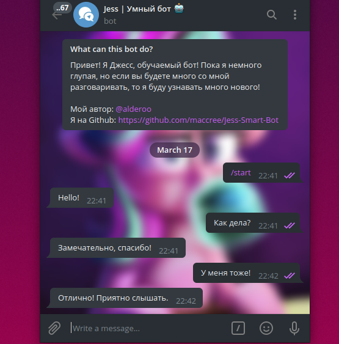

                                         Self-learning telegram bot!


# Self-taught!

The more you interact with Jess, the smarter she gets! Thanks to Dialog Flow, it analyzes your messages and remembers how to talk or answer questions correctly! Also, if Jess does not know how to respond to Your message, then she will keep silent and go to the Internet to understand what to answer next time!

# How does it work?

It's very simple! You just write to [Jess](http://t.me/jess_robot) and she answers you. That is, just chat with her as with an ordinary person and she will try to answer you!



# Do you want the same?

### Install Python libraries:

1. Download the python library *python-telegram-bot*:
```bash
pip install python-telegram-bot
```
2. Download the python library *apiai*:
```bash
pip install apiai
```
### Create a bot in BotFather

Writing [BotFather](http://t.me/botfather) in the telegram:


Next, BotFather should send you a **token**, we will need it again!

### DialogFlow

Register on [Dialogflow](https://dialogflow.com/). Click on the **Create agent** button and fill in the fields as you wish. Click on **Prebuilt Agents** and select **Small Talk**. Point to it and click **Import**. Further, without changing anything, click **Ok**. The agent was imported and now we can configure it. To do this, in the upper left corner, click on the **gear near Small-Talk** and get to the settings page. Change the time zone in the **Languages tab**.

### Installing and preparing the code

1. Installing the repository:
```bash
git clone https://github.com/maccree/Jess-Smart-Bot.git
```

2. In the file main.py in line # 6, instead of <YOUR ARE HERE>, insert the token that BotFather sent:
```python
updater = Updater(token='<YOUR TOKEN HERE>')
```
3. On DialogFlow go back to the **General tab**, go down a bit and copy **Client access token**. In the file main.py in line # 13, instead of <YOUR TOKEN HERE>, insert your dialog token
```python
    request = apiai.ApiAI('<YOUR TOKEN HERE>').text_request()
```

4. Launching the bot:
```bash
python main.py
```
### Your bot is working!

## P.s.

**If something doesn't work, please email me in the Telegram -> [@alderoo](http:/t.me/alderoo)**
